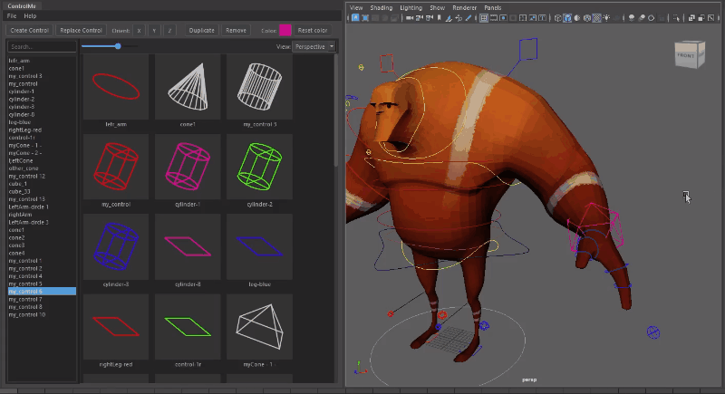
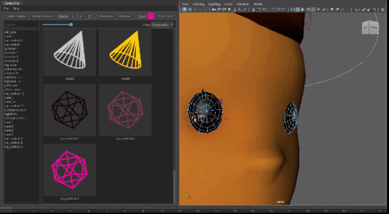
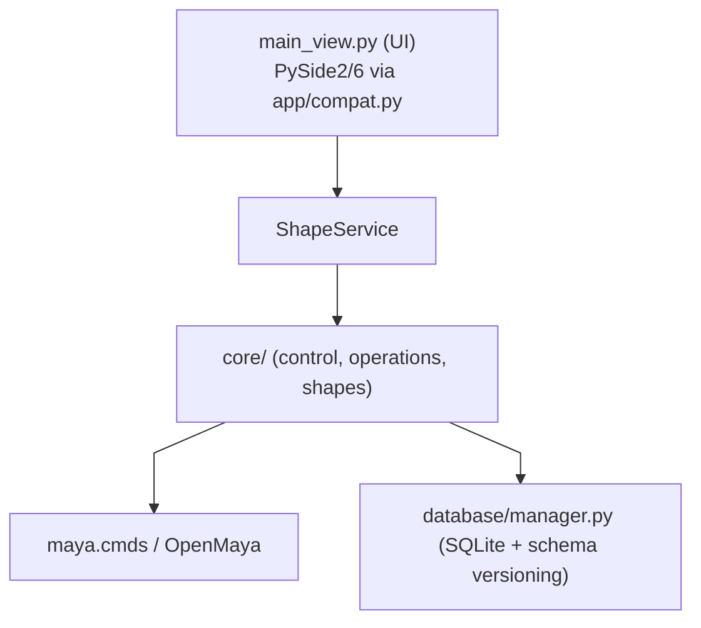

# maya-control-tools

Maya tool for creating, replacing and managing rig control shapes (NURBS curves) with a PySide2/PySide6 UI.


[](https://github.com/soyyotedigo/maya-control-tools/actions/workflows/test-maya-versions.yml)


---

## Why it matters

Riggers and animators spend hours creating or tweaking control curves by hand, and replacing a control the traditional way breaks its animation connections and pivots. ControlMe replaces this manual workflow with a browsable shape library, in-place replacement that preserves connections, and a persistent SQLite store for custom shapes — so a rigger can ship consistent controls across a show without losing work.

---

## Quick demo

### 1) Create / apply controls



Comment:
- You can save multiple versions of the same control with different colors to the database, then replace existing controls in your scene while preserving their behavior and connections—without breaking anything. The database is fully exportable.

### 2) Replace existing controls



Comment:
- You can extract controls from existing geometry, change their colors, duplicate them, delete them, and replace existing scene controls with library shapes — all without breaking animation or connections.

## What it does

- **Browse** a library of 13 built-in NURBS primitives — circle, square, triangle, arrow, double arrow, cross, cube, diamond, locator, four arrow, three arrow, octahedron, and cone — with live search and QPainter-rendered previews
- **Apply** a shape to any selected node in one click
- **Replace** the shape on an existing control **without losing its connections, pivot, or position** — the hard part of rigging pipeline work
- **Remove** shapes from a node
- **Set color** via RGB override on the shape node
- **Save custom shapes** from your scene into a local SQLite library that persists between sessions

---

## Requirements

- Maya 2022 or newer (Python 3)
- PySide2 or PySide6 — bundled with Maya, no install needed
- `config.toml` at the repo root — edit this file to change settings, no Python required
- **Zero pip installs** — uses only Maya's bundled Python (`PySide`, `sqlite3`, `maya.cmds`, `maya.api.OpenMaya`) and the standard library. Safe for locked studio pipelines.

---

## Installation

### Option A — Drag and drop (recommended, no Python required)

1. Download or clone this repo anywhere on your machine
2. Open Maya
3. Drag `install.py` into the Maya viewport
4. Click **OK** in the confirmation dialog
5. Restart Maya — the **ControlMe** shelf button appears automatically

No terminal or Python installation needed.

---

### Option B — Command line (for developers)

Requires Python to be available in your terminal (separate from Maya).

```bash
# auto-detects the newest installed Maya version
python install_module.py

# or specify a version explicitly
python install_module.py --maya 2025
```

Installs ControlMe as a proper Maya module (`.mod`) under `~/maya/<version>/modules/` (or `~/Documents/maya/<version>/modules/` on Windows).

---

## Usage

Once installed, click the **ControlMe** button on the Maya shelf.

To launch manually from the Script Editor (Python tab):

```python
import runpy, sys
sys.path.insert(0, "/path/to/maya-control-tools")
runpy.run_path("main.py")
```

Or paste the contents of `main.py` directly into the Script Editor — the script re-runs fresh on every execution.

---

## Project structure

```
maya-control-tools/
├── main.py                  # Script Editor entry point (hot-reload safe)
├── config.toml              # User-editable settings (version, logging, cache)
├── install.py               # Drag-and-drop installer for Maya viewport
├── install_module.py        # CLI installer — writes .mod file
├── app/
│   ├── compat.py            # PySide2/PySide6 abstraction + headless test stub
│   ├── config.py            # TOML loader — exports VERSION, WINDOW_TITLE, etc.
│   ├── logger.py            # Rotating file + console logging
│   ├── paths.py             # Repo-root path resolution
│   ├── core/
│   │   ├── control.py           # Maya curve operations (apply, replace, color)
│   │   ├── control_creation.py  # Control creation pipeline
│   │   ├── operations.py        # High-level shape operations
│   │   ├── shape_data.py        # Shape data containers
│   │   ├── shape_service.py     # Service layer between UI and core
│   │   ├── shapes.py            # Built-in shape library (CV point data)
│   │   └── om2_utils.py         # OpenMaya 2 helpers
│   ├── database/
│   │   └── manager.py       # SQLite persistence for custom shapes
│   ├── models/
│   │   └── search.py        # Substring search helper
│   ├── styles/              # QSS stylesheets
│   ├── icons/               # UI icons
│   └── views/
│       ├── main_view.py     # Main window — wires everything together
│       ├── groups_view.py   # Left panel: shape outliner with live search
│       ├── images_view.py   # Right panel: icon grid with QPainter previews
│       └── widgets.py       # Shared primitives (AbstractWidget, ColorSwatch)
├── module/
│   ├── ControlMe.mod        # Maya module descriptor
│   └── scripts/
│       └── userSetup.py     # Auto-loads shelf on Maya startup
├── scripts/
│   ├── run_maya_tests.sh    # Run Maya integration tests via mayapy (Linux/macOS/Git Bash)
│   └── run_maya_tests.bat   # Run Maya integration tests via mayapy (Windows cmd)
└── tests/
    ├── test_search.py
    ├── test_database.py
    ├── test_control.py
    ├── test_operations.py
    ├── test_control_creation.py
    ├── test_shape_service.py
    ├── test_main_view.py
    ├── test_views_ui.py     # Qt UI tests (headless via compat stub)
    └── maya/                # Real Maya integration tests (require mayapy)
```

---

## Architecture highlights


---

- **Compat layer** — `app/compat.py` auto-selects PySide2, PySide6, or a headless test stub; all views import Qt bindings from here, never directly from PySide
- **Central config** — `config.toml` → `app/config.py`; version, title, logging, and cache settings in one place, no Python editing needed
- **Strategy pattern** — search is pluggable (`ContainsStrategy`, `StartsWithStrategy`, `EndsWithStrategy`)
- **Service layer** — `shape_service.py` sits between the UI and `core/`; views never call Maya directly
- **AbstractWidget** — enforces `create_widgets / create_layout / create_connections` across all panels
- **QPainter previews** — shape thumbnails rendered procedurally from CV data, no external images needed
- **SQLite library** — built-in shapes seeded on first run; custom shapes persist between sessions
- **Rotating log** — `app/logger.py` writes to a capped log file next to the repo; configurable via `config.toml`

---

## Skills demonstrated

This project is a portfolio piece for pipeline TD work. It showcases:

- **Cross-version Maya compatibility** via a PySide2/PySide6 abstraction layer (`app/compat.py`) — one codebase runs on Maya 2022–2026
- **Testable architecture** — MVP + service layer, so UI and Maya runtime can be mocked independently (86 unit/UI tests run without Maya)
- **Production hygiene** — rotating logs, SQLite schema migrations with a version counter, TOML-driven config, no hard-coded values
- **Deployment discipline** — proper Maya `.mod` packaging via `install_module.py`, drag-and-drop installer for artists, zero external dependencies
- **CI pipeline** — unit, UI (headless Qt), and real Maya runtime tests run in separate GitHub Actions jobs across Maya 2022–2026 Docker images

---

## Running tests

```bash
cd maya-control-tools
pip install pytest
pytest tests/ --ignore=tests/maya
```

Current test layers:

- `tests/test_search.py`, `tests/test_database.py`, `tests/test_control.py`, `tests/test_operations.py`, `tests/test_control_creation.py`, `tests/test_shape_service.py`: unit tests with Maya mocked
- `tests/test_views_ui.py`: Qt UI tests for `OutlinerWidget` and `ImageView`
- `tests/maya/`: real Maya integration tests run with `mayapy`

Run unit tests only:

```bash
pytest tests --ignore=tests/maya --ignore=tests/test_views_ui.py -q
```

Run UI tests headless:

```bash
QT_QPA_PLATFORM=offscreen pytest tests/test_views_ui.py -q
```

Run real Maya integration tests locally:

```bash
# Linux / macOS / Git Bash
bash scripts/run_maya_tests.sh

# Windows cmd
scripts\run_maya_tests.bat
```

GitHub Actions runs the suite in three groups:

- unit tests on standard Python
- UI tests on standard Python with PySide6
- Maya integration tests in Docker against Maya 2022, 2023, 2024, 2025, and 2026 images when available

This keeps failures isolated instead of mixing pure Python, Qt, and real Maya runtime checks in one job.

---
